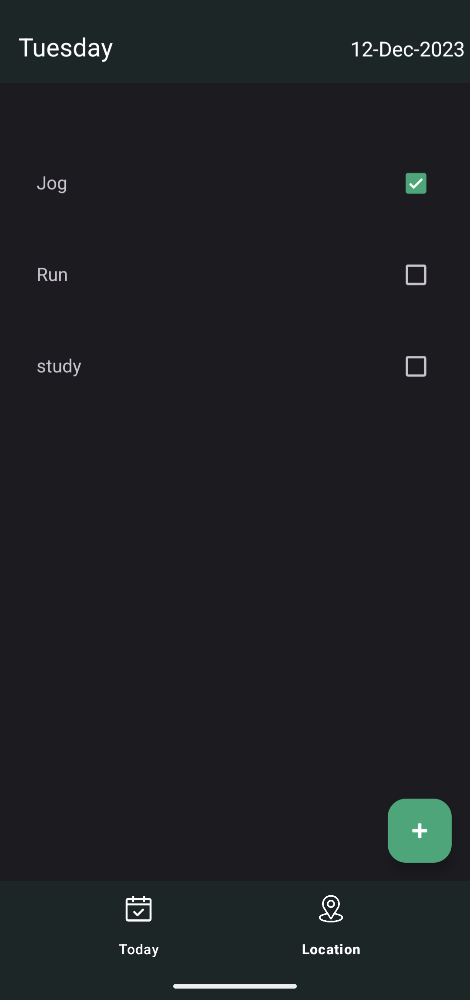
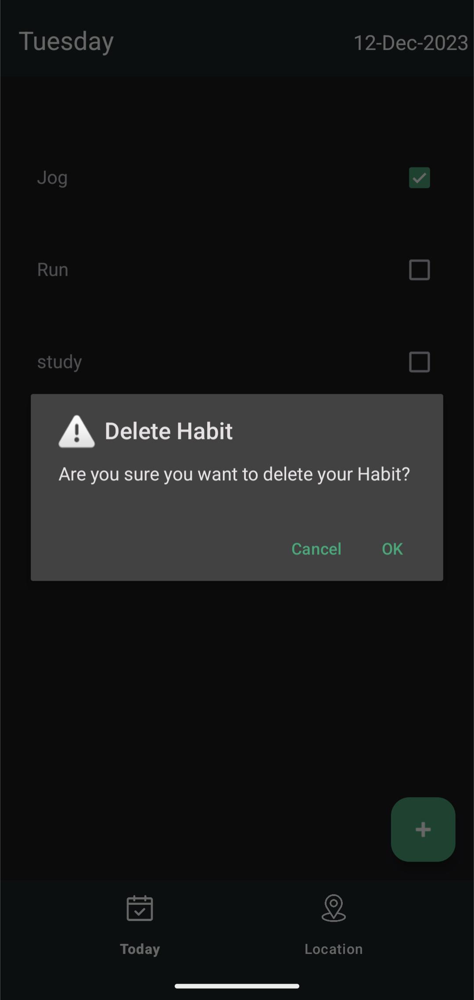
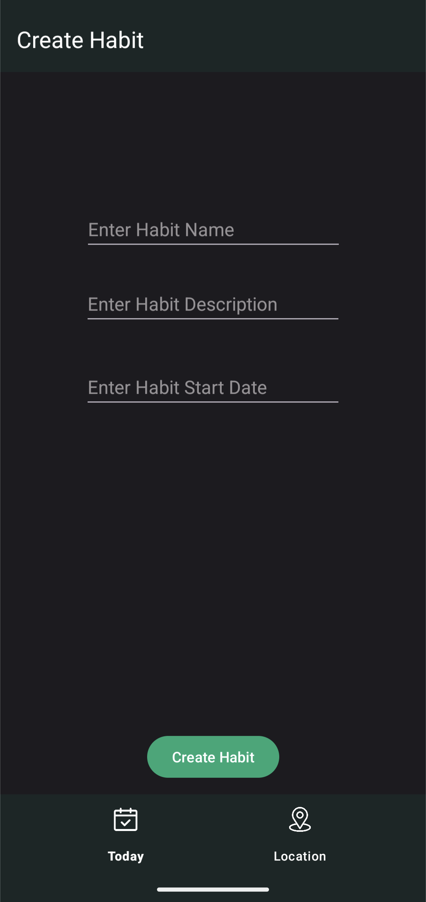
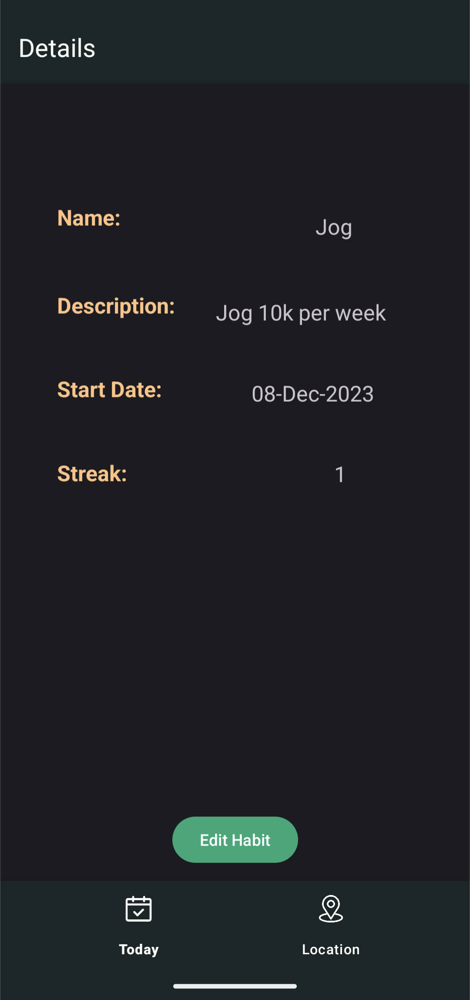
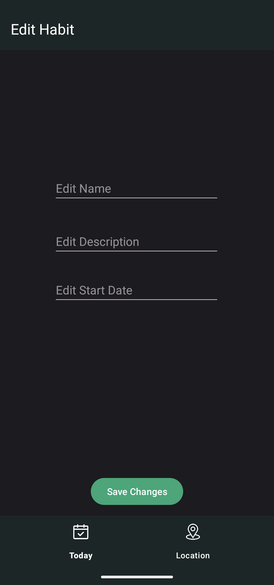
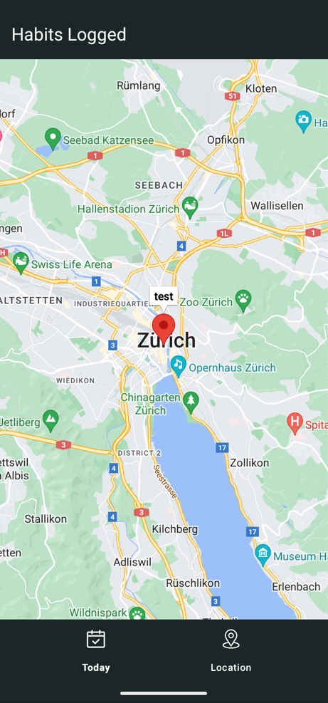

# Habit Tracker App
Android application written in Java using Android Studio as part of my Mobile Software Development module.
### Main functionality:
- User can create habits with a name, description and start date.
- Habits can be viewed, edited and deleted on a long press.
- Habits are tracked upon clicking a checkbox.
- Location is logged, and a streak is started.
- Checkbox resets at the start of a new day.
- Streaks continue if habits are logged in consecutive days.

## 1. Main Activity 

  
  

Main Activity displays habits in a recycler view. Check box to tick off habits. Plus button in bottom right to add a new habit. Clicking on habits brings you to a more detailed view. Long press on habit prompts you to delete it.

Top bar displays current day and date. Bottom navigation consistent across all activities, can be clicked to go back to main page or go to map view. 

## 2. Create Activity

Number of fields for the user to enter details. Clicking on start date prompts a calendar view for the user to enter. Create habit button confirms habit creation with a toast message.

## 3. Details Activity

Displays user entered ifnromation. Displays the habit streak, which is incremented if habits are completed in consecutive days. Edit habit button at the bottom to edit the details. 

## 4. Edit Activity 

Edit Text boxes for users to enter in the new information, and a save change button to confirm these changes. Toast message to confirm. 
Map is zoomed on where the habits were completed. 

## 5. Map Activity 

Google map fragment used to display where habits were completed on that day. Complete with markers to show precise location. Clicking on a marker shows the habit name. 
